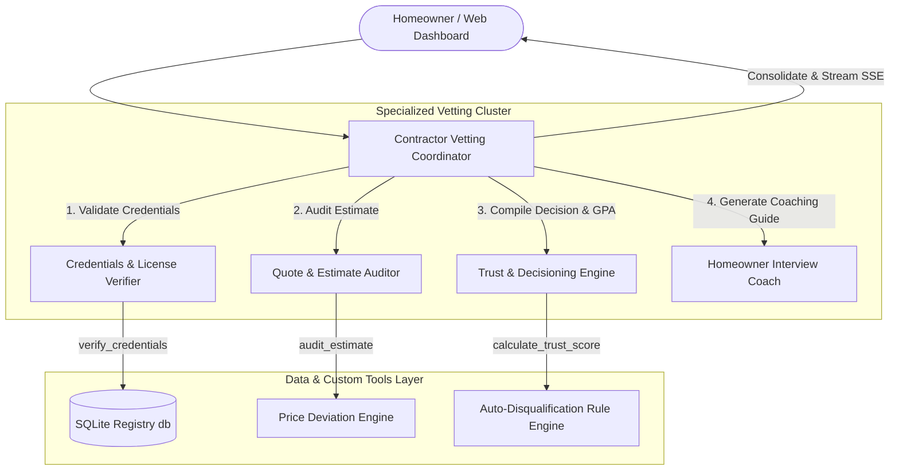

# ShieldGuard AI: Multi-Agent Contractor Vetting Platform

ShieldGuard AI is a production-grade, multi-agent contractor vetting application built using the **Google ADK (Antigravity SDK)** and **FastAPI**. It organizes a hierarchical cluster of specialized AI agents to automate the comprehensive vetting of residential contractors—validating credentials, auditing pricing estimates against market averages, detecting lawsuits, and generating custom strategic interview coaching guides for homeowners.

The platform includes both an interactive **Command Line Interface (CLI)** and a stunning **Dark-Mode Web Dashboard** with real-time progress streaming using Server-Sent Events (SSE).

---

## 🏗️ Technical Architecture

The platform implements a **Hub-and-Spoke / Parent-Coordinator** topology to coordinate domain expertise across four specialized sub-agents:



### Specialized Agents & Roles
*   **Lead Coordinator (`contractor_vetting_coordinator`)**: Root supervisor agent. Orchestrates the workflow, delegates tasks, and synthesizes final outcomes into a polished report.
*   **License Verifier (`license_verifier_agent`)**: Validates professional licensing, legal standing, active state compliance, and insurance.
*   **Estimate Auditor (`quote_auditor_agent`)**: Audits cost quotes against regional market rates to identify low-ball (bait-and-switch) or overpricing risks.
*   **Trust Decisioning (`trust_decisioning_agent`)**: Calculates a weighted vetting GPA (0.0 - 4.0 scale) and strictly enforces the **Auto-Disqualification Rule** (dropping GPA directly to 0.0 if a license is invalid or lawsuits are found).
*   **Interview Coach (`interview_coach_agent`)**: Drafts custom, tactical interview questions preparing the homeowner to address discovered warning flags.

---

## 📂 Project Structure

```text
contractor-vetting-agent/
├── app/
│   ├── __init__.py
│   ├── agent.py            # Agent definitions, system prompts, and configuration
│   ├── agent_runtime_app.py# App Engine template runtime for GCP deployment
│   ├── mock_data.py        # SQLite local database seeding and registry lookup
│   ├── server.py           # FastAPI REST API and live SSE stream endpoint
│   └── vetting_tools.py    # Math scoring logic and credential check Python tools
├── static/                 # Single Page Application Web client
│   ├── app.js              # SSE streaming client and result compiler
│   ├── index.html          # Semantically structured HTML5 template
│   └── style.css           # Premium Dark Mode glassmorphic CSS
├── tests/                  # Pytest verification suites
│   ├── __init__.py
│   ├── integration/
│   │   ├── test_agent.py   # ADK multi-agent stream tests
│   │   └── test_server.py  # FastAPI routing and SSE response header tests
│   └── pyproject.toml      # Modern Python packaging configuration
├── .gitignore              # Local configuration excluding transient assets
├── run_demo.py             # Interactive terminal-based execution console
└── README.md               # Quickstart and project overview (this file)
```

---

## 🚀 Quickstart Guide

### 1. Prerequisites & Environment Setup
Verify you have Python 3.13+ installed, clone the repository, and activate your environment:

```bash
# Navigate to the project directory
cd contractor-vetting-agent

# Create Python virtual environment if not present
python3 -m venv .venv
source .venv/bin/activate

# Install required packages (FastAPI, Uvicorn, Google ADK, Pytest, Faker)
pip install -r pyproject.toml
```

### 2. Option A: Run the Live CLI Demo
Run the interactive console dashboard to select preloaded contractors and watch real-time tool calls and agent reasoning logs stream in your terminal:

```bash
PYTHONPATH=. python3 run_demo.py
```

### 3. Option B: Launch the Web Dashboard
Start the lightweight FastAPI backend server to serve static assets and establish Server-Sent Events (SSE):

```bash
# Start the local development server
PYTHONPATH=. python3 -m uvicorn app.server:app --host 127.0.0.1 --port 8000
```
👉 Open your web browser and navigate to: **[http://127.0.0.1:8000](http://127.0.0.1:8000)**

---

## 🧪 Running Automated Tests
The suite includes full integration coverage testing multi-agent orchestration, REST routing, and event stream emissions:

```bash
PYTHONPATH=. pytest tests/integration/ -v
```

---

## 📐 Core Vetting Logic & Math

### Vetting GPA (0.0 - 4.0 Scale)
A contractor's trust GPA is evaluated on a standard 4.0 scale when compliant:
-   **Customer Reputation Score (50%)**: Derived directly from customer reviews:
    $$\text{Reputation Points} = \left(\frac{\text{Rating}}{5.0}\right) \times 2.0$$
-   **Pricing Score (50%)**: Calculated based on the absolute percentage deviation from average market rates:
    $$\text{Deviation} = \frac{|\text{Bid} - \text{Market Average}|}{\text{Market Average}} \times 100$$
    *   **Within 10% deviation (Excellent)**: 2.0 Points
    *   **10% - 25% deviation (Moderate Risk)**: 1.2 Points
    *   **25% - 40% deviation (High Risk / Low-ball Bid)**: 0.5 Points
    *   **>40% deviation (Extreme Anomaly)**: 0.0 Points

### The Auto-Disqualification Rule
The scoring engine strictly overrides all metrics and sets the final GPA directly to **0.0 (F-grade)** if compliance checks detect:
1.  An expired or invalid contractor license.
2.  An active lawsuit or litigation history.
$$\text{License Invalid} \lor \text{Lawsuit Found} \implies \text{Vetting GPA} = 0.0 \quad \text{(AUTO-DISQUALIFIED)}$$

---

## 🛡️ Enterprise ShieldGuard Extension Features

We have extended the base platform with advanced enterprise features to meet the highest safety, memory, tracing, and infrastructure standard requirements:

### 1. Persistent Session Memory Database & Compaction
*   **Persistent Storage**: Conversational histories are saved across multi-turn sessions in the local SQLite database (`session_history` table).
*   **Asynchronous Operations**: Memory reads, writes, and processing are done asynchronously in a background thread-pool (`asyncio.to_thread`) to prevent UI lag.
*   **Context Compaction**: If conversation length exceeds 8 turns, a background task automatically condenses the oldest turns, compiling them into a single high-level summary to prevent LLM context-window expansion and keep token usage highly efficient.

### 2. Policy Guardrails & Human-in-the-Loop (HITL) Logs
*   **Policy Guardrails**: Programmatic security guardrails (`evaluate_security_policy` tool) scan inputs for prompt injection or compliance-scale manipulation.
*   **Human-in-the-Loop**: High-stakes decisions require manual approval through the `request_human_approval` tool, which tracks verification attempts and logs detailed traces to an administrative file.

### 3. Distributed Tracing & PII Redaction
*   **Structured JSON Logging**: The entire FastAPI server and tool chain have been migrated from basic print logs to standard python loggers outputting compliant JSON formats.
*   **Intent vs. Outcome Tracking**: Pre-execution intent logging and post-execution outcome telemetry ensure exact tool performance audits.
*   **Distributed Tracing**: Standard context propagation correlates request flows with a custom UUID-based TraceSpan context tracker.
*   **PII Masking**: Regular expression compliance redacts credit cards, emails, social security numbers, and phone numbers from logs and streamed tokens.

### 4. Golden Dataset Evaluation & IaC Provisioning
*   **Golden Dataset Test Suite**: Programmatic regression tests (`tests/integration/test_golden_dataset.py`) validate the entire agentic pipeline against standard, borderline, and unsafe contractor profiles.
*   **Infrastructure as Code (IaC)**: Deployable Terraform configuration templates (`terraform/main.tf`) automate provisioning for Vertex AI Agents, serverless Cloud Run hosts, Firestore Native, and Secret Manager.
*   **CLI Provisioning Utility**: An automated shell script (`scripts/provision.sh`) wraps standard gcloud and Terraform setups into a single terminal run.
